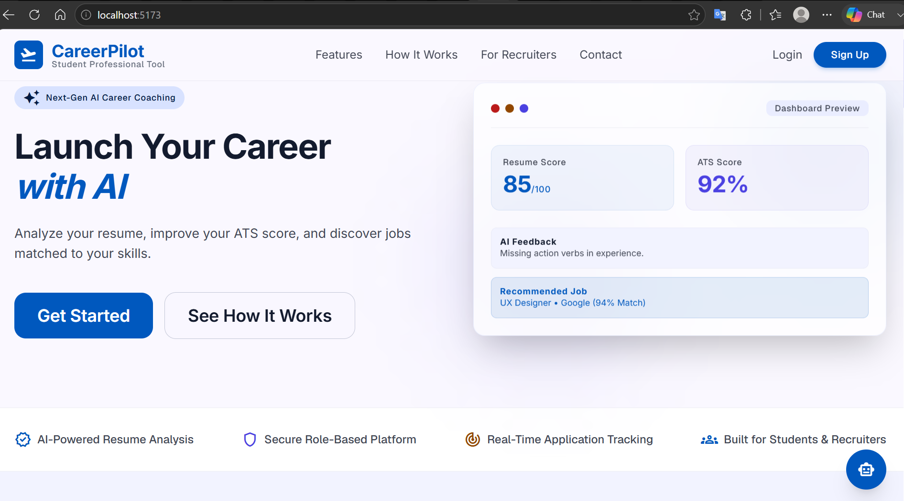
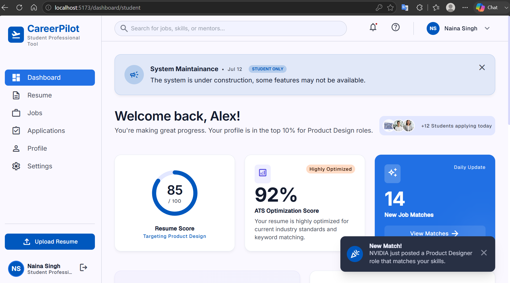
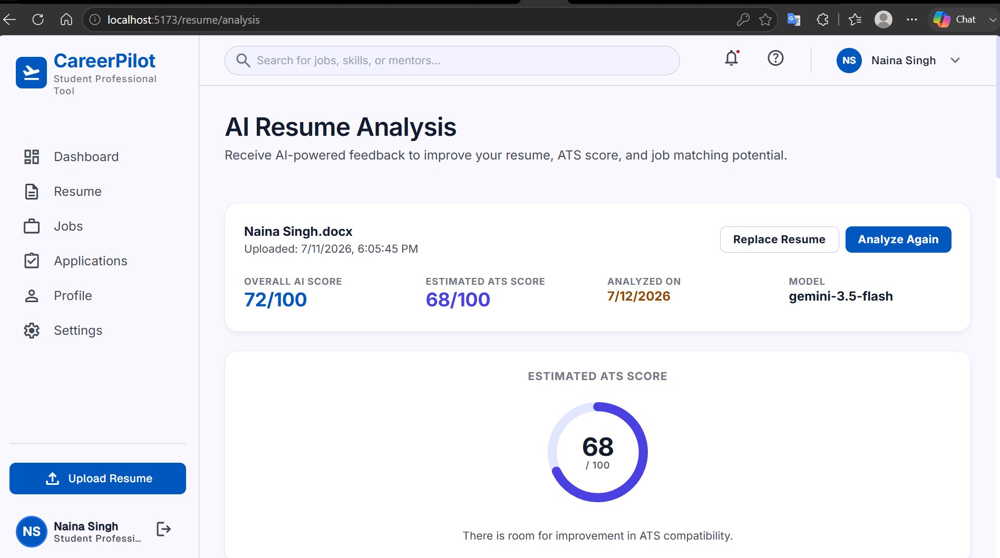
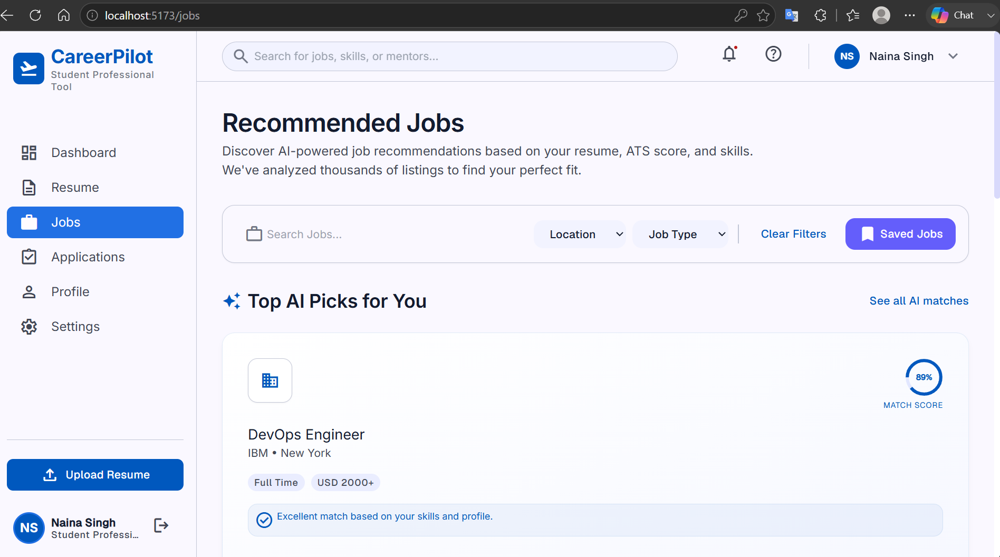
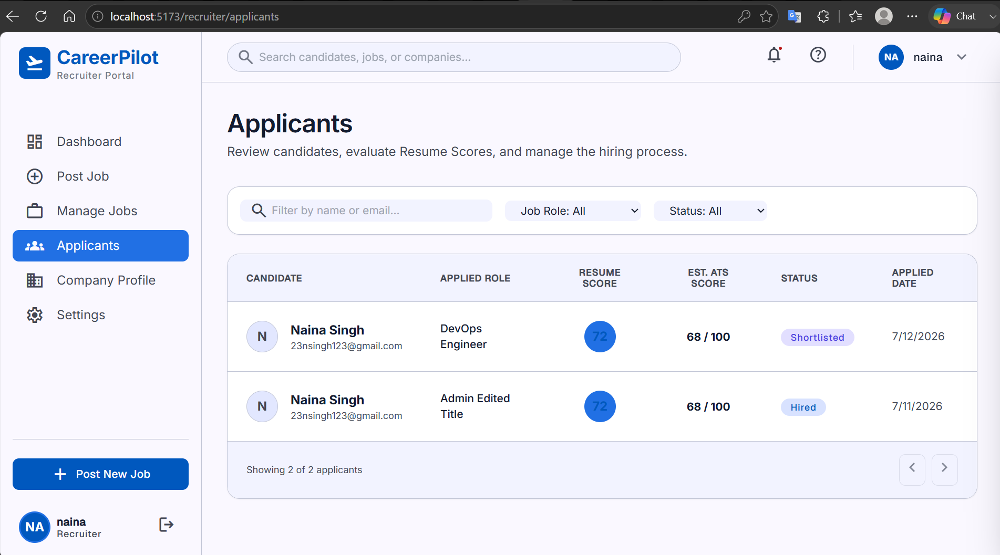
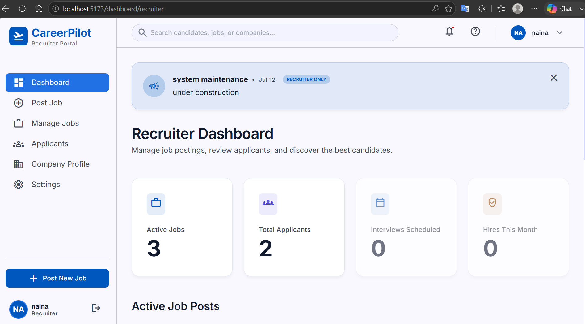
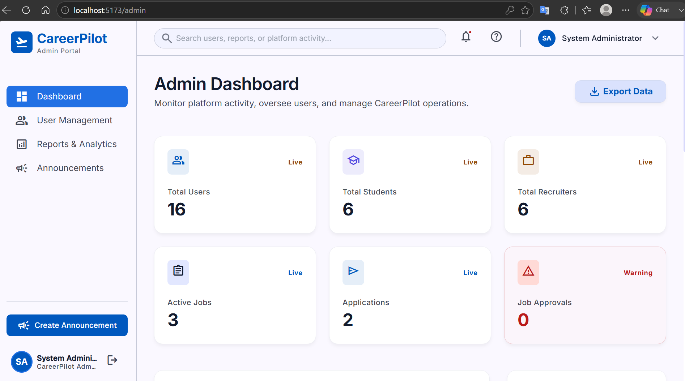
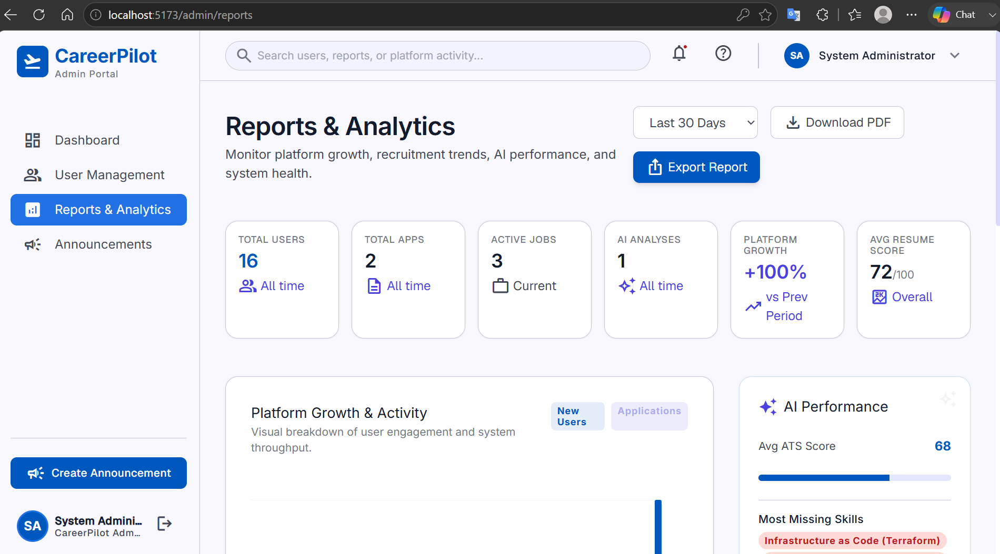
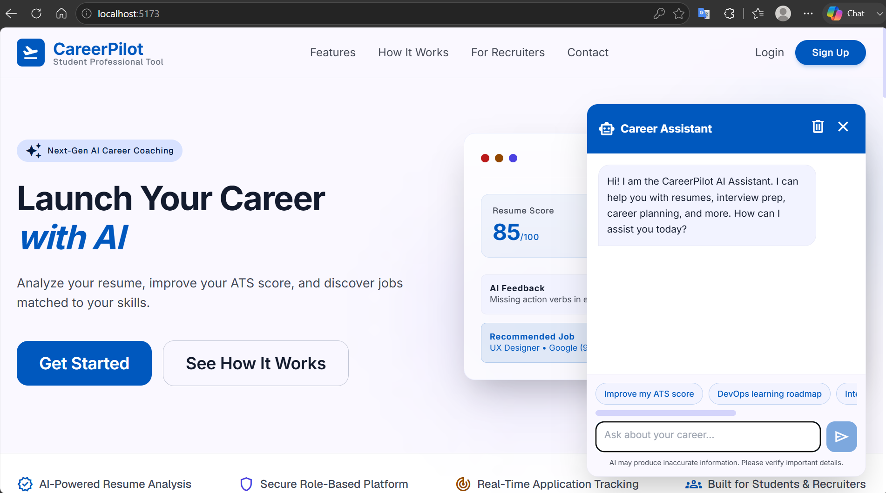

# CareerPilot 🚀

CareerPilot is a modern, AI-powered career platform designed to bridge the gap between job seekers (students), recruiters, and platform administrators. Built with a scalable MERN stack and leveraging the Google Gemini AI, CareerPilot provides intelligent resume analysis, a career coaching chatbot, and comprehensive job application management.

---

## 📖 Table of Contents
- [Features](#features)
- [AI Features](#ai-features)
- [Tech Stack](#tech-stack)
- [Folder Structure](#folder-structure)
- [Installation](#installation)
- [Environment Variables](#environment-variables)
- [Running the Project](#running-the-project)
- [API Overview](#api-overview)
- [Security Features](#security-features)
- [Screenshots](#screenshots)
- [Future Improvements](#future-improvements)
- [Author](#author)
- [License](#license)

---

## ✨ Features

### 🎓 Student Portal
- **Profile Management:** Update personal details, headline, summary, and upload profile pictures.
- **Resume Management:** Upload and manage PDF resumes.
- **Job Search & Filters:** Search jobs by title, location, and employment type.
- **Quick Apply:** One-click application process with optional cover letter attachments.
- **Application Tracking:** Monitor the real-time status of submitted applications.

### 🏢 Recruiter Portal
- **Dashboard:** At-a-glance metrics of active jobs, total applicants, and recent activity.
- **Job Management:** Create, edit, and close job postings.
- **Applicant Review:** Review incoming applications via a slide-out drawer, change applicant statuses (Pending, Shortlisted, Rejected), and view applicant profiles.
- **Company Profile:** Update company branding and details.

### 🛡️ Admin Portal
- **Analytics Dashboard:** Visualize platform health (users, jobs, applications) with weekly/monthly toggles.
- **User Management:** View all users, suspend or activate accounts, and modify user roles.
- **Data Export:** Export platform analytics via CSV or generate comprehensive PDF reports.
- **Announcements:** Broadcast platform-wide or role-specific announcements to active users.

---

## 🤖 AI Features
Powered by **Google Gemini 2.5 Flash**:

1. **Resume Analysis:** Extracts and evaluates uploaded resumes against industry standards.
2. **ATS Score Estimation:** Provides an estimated Applicant Tracking System (ATS) compatibility score.
3. **Actionable Feedback:** Generates strengths, missing skills, and recommended roles based on resume content.
4. **Career Assistant Chatbot:** A responsive, session-based chatbot accessible from the landing page. It acts as a professional career coach, answering questions strictly related to resumes, interviews, job searching, cloud, and DevOps.

---

## 🛠️ Tech Stack

**Frontend:**
- React 18
- Vite
- Tailwind CSS
- React Router DOM
- Axios
- jsPDF & jsPDF-AutoTable (Client-side PDF generation)

**Backend:**
- Node.js
- Express.js
- MongoDB & Mongoose
- JSON Web Tokens (JWT) & Bcrypt (Authentication)
- Multer (File uploads)
- @google/genai (Gemini AI Integration)

---

## 📂 Folder Structure

```text
CareerPilot/
├── backend/
│   ├── src/
│   │   ├── controllers/      # Route controllers (auth, users, jobs, chat, etc.)
│   │   ├── middleware/       # JWT auth, role validation, rate limiting
│   │   ├── models/           # Mongoose schemas (User, Job, Application, Announcement)
│   │   ├── routes/           # Express routers
│   │   ├── services/         # Gemini AI integrations, PDF parsing
│   │   ├── app.js            # Express app configuration
│   │   └── server.js         # Entry point
│   ├── .env                  # Environment variables
│   └── package.json
├── src/
│   ├── components/           # Reusable UI components (AIChatAssistant, useToast, etc.)
│   ├── context/              # React Context (AuthContext)
│   ├── pages/                # Page views (Dashboards, LandingPage, JobListings)
│   ├── services/             # Axios API wrappers
│   ├── index.css             # Tailwind configuration
│   └── main.jsx              # React entry point
├── dist/                     # Production build artifacts
├── tailwind.config.js
├── vite.config.js
└── package.json
```

---

## ⚙️ Installation

1. Clone the repository.
2. Install frontend dependencies:
   ```bash
   npm install
   ```
3. Install backend dependencies:
   ```bash
   cd backend
   npm install
   ```

---

## 🔐 Environment Variables

Create a `.env` file in the `backend/` directory:

```env
PORT=5000
MONGODB_URI=your_mongodb_connection_string
JWT_SECRET=your_jwt_secret_key
GEMINI_API_KEY=your_google_gemini_api_key
GEMINI_MODEL=gemini-2.5-flash
```
*Note: Ensure `.env` is added to your `.gitignore` file to prevent exposing secrets.*

---

## 🚀 Running the Project

**1. Start the Backend Server**
```bash
cd backend
npm start
# Server runs on http://localhost:5000
```

**2. Start the Frontend Development Server**
```bash
npm run dev
# Frontend runs on http://localhost:5173
```

**3. Build for Production**
```bash
npm run build
```

---

## 🌐 API Overview

- **Auth:** `POST /api/auth/register`, `POST /api/auth/login`
- **Users:** `GET /api/users/me`, `PUT /api/users/profile`, `POST /api/users/profile-image`
- **Jobs:** `GET /api/jobs`, `POST /api/jobs`, `PUT /api/jobs/:id`
- **Applications:** `POST /api/applications`, `GET /api/applications/my`, `PATCH /api/applications/:id/status`
- **Resume & AI:** `POST /api/resume/upload`, `POST /api/resume/analyze`
- **Chatbot:** `POST /api/chat` (Rate-limited, AI queries)
- **Admin:** `GET /api/admin/dashboard`, `PATCH /api/admin/users/:id/role`

---

## 🛡️ Security Features
- **JWT Authentication:** Secure stateless authentication for all protected routes.
- **Role-Based Access Control (RBAC):** Dedicated middlewares isolate Student, Recruiter, and Admin endpoints.
- **Protected Public Signup:** API strictly blocks the public registration of `admin` roles.
- **Password Encryption:** Passwords are hashed using bcrypt before hitting the database and are never returned in JSON payloads.
- **Rate Limiting:** IP-based memory rate limiting protects the public AI Chat endpoint from abuse.
- **Prompt Injection Defense:** Strict backend-only system instructions confine the Gemini chatbot solely to professional career topics.

---

## 📸 Screenshots

### Landing Page


### Student Dashboard


### Resume Analysis


### Jobs Page


### Applications


### Recruiter Dashboard


### Admin Dashboard


### Reports & Analytics


### AI Career Chatbot


---

## 🔮 Future Improvements
- **Persistent Chat History:** Store AI Chatbot conversations in MongoDB.
- **Advanced ATS Matching:** Implement vector embeddings for semantic matching between resumes and job descriptions.
- **Automated Interview Scheduling:** Allow recruiters to sync calendars and auto-schedule interviews with shortlisted candidates.
- **Email Notifications:** Integrate SendGrid or AWS SES for status update notifications.

---

## ✍️ Author
Naina Singh

---

## 📄 License
This project is licensed under the [MIT License](LICENSE).
